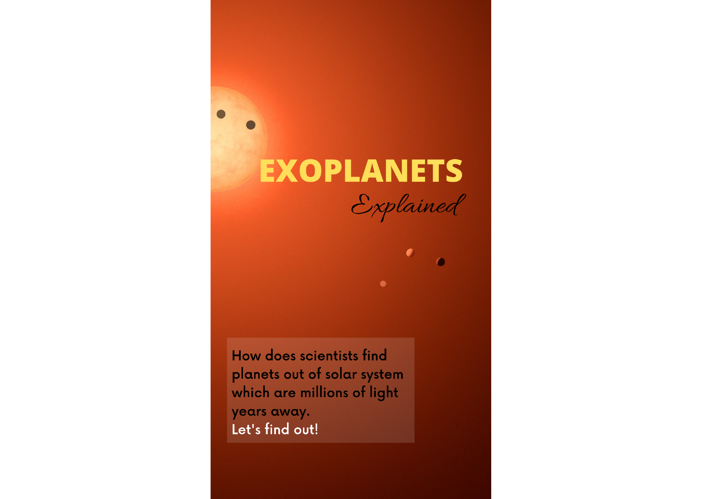
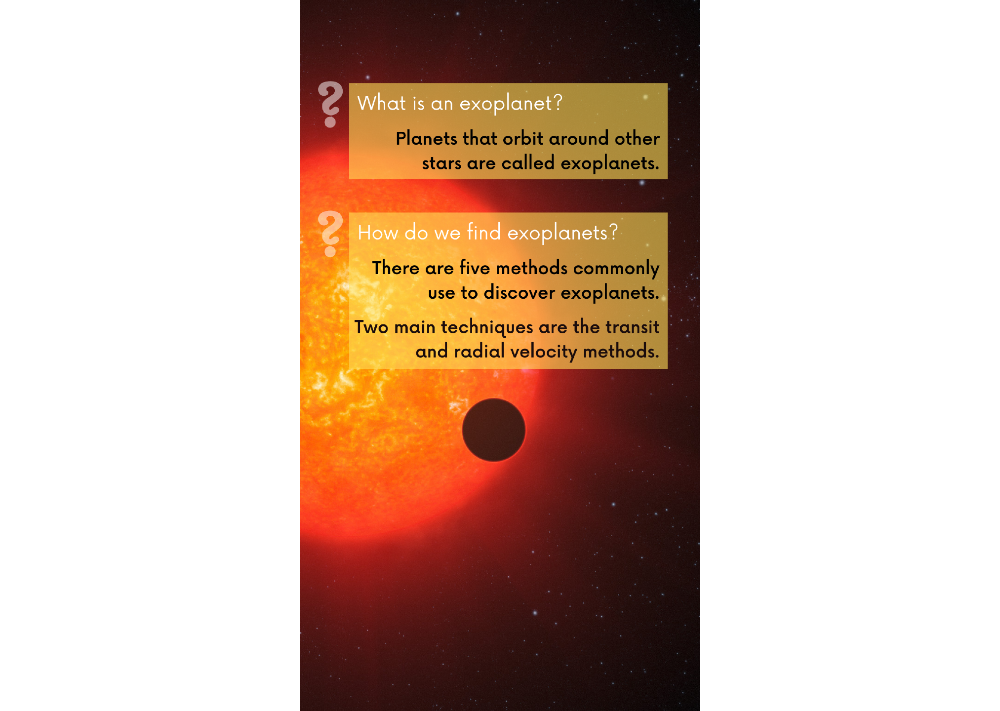
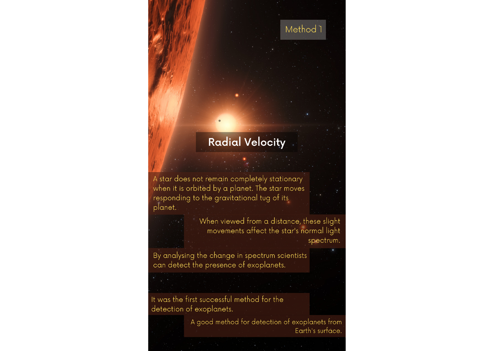
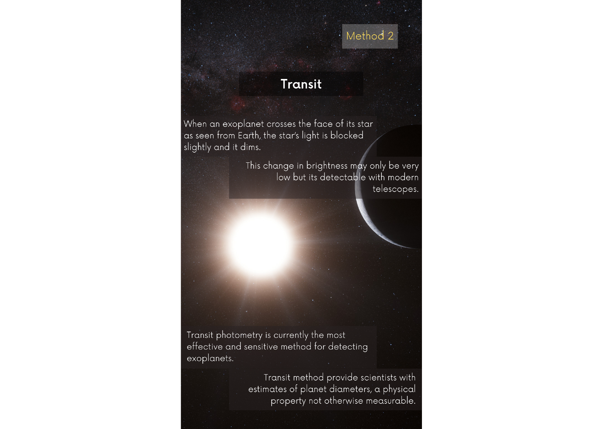
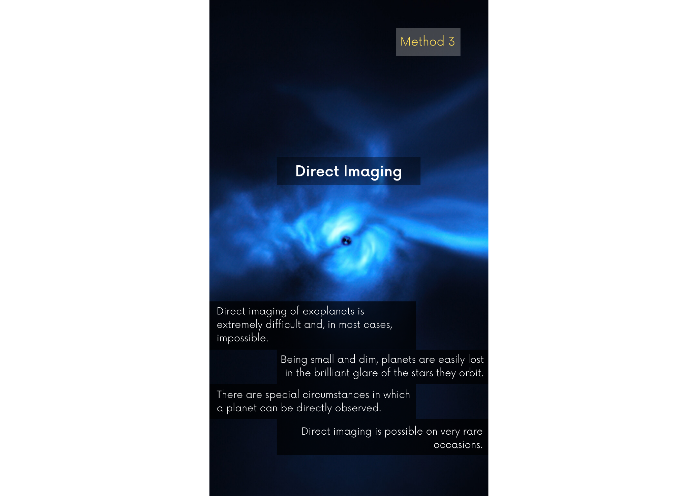
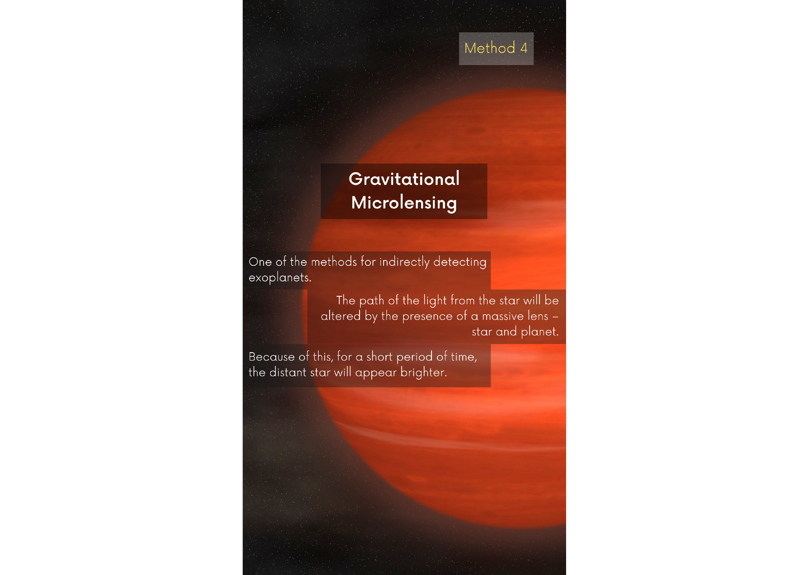
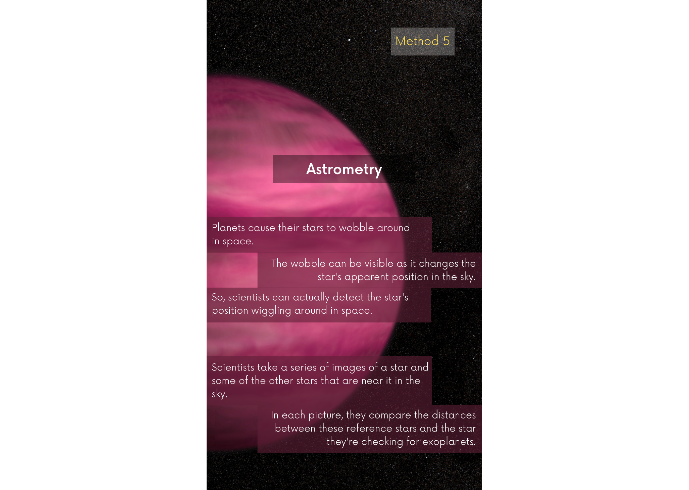

<meta name="viewport" content="width=device-width, initial-scale=1">

<body>

  
  
  
  
  
  
  
  
  

    <button type="button" class="slider-button" onclick="plusDivs(-1)">&#10094;</button>
    <button type="button" class="slider-button" onclick="plusDivs(1)">&#10095;</button>
  

</body>
