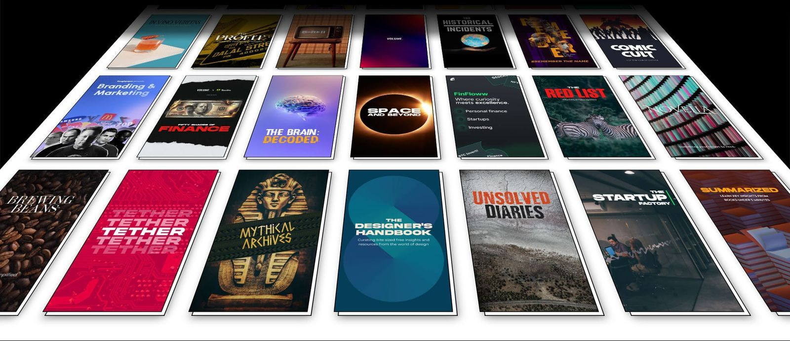

### What is Volume?
Volume is a platform for visual micropublications. You can access curated bite-sized magazines from here.

I am creator on Volume and you can access my content in volume through this link, [ASTRONOMY Explained](https://volumestories.page.link/58mV).

